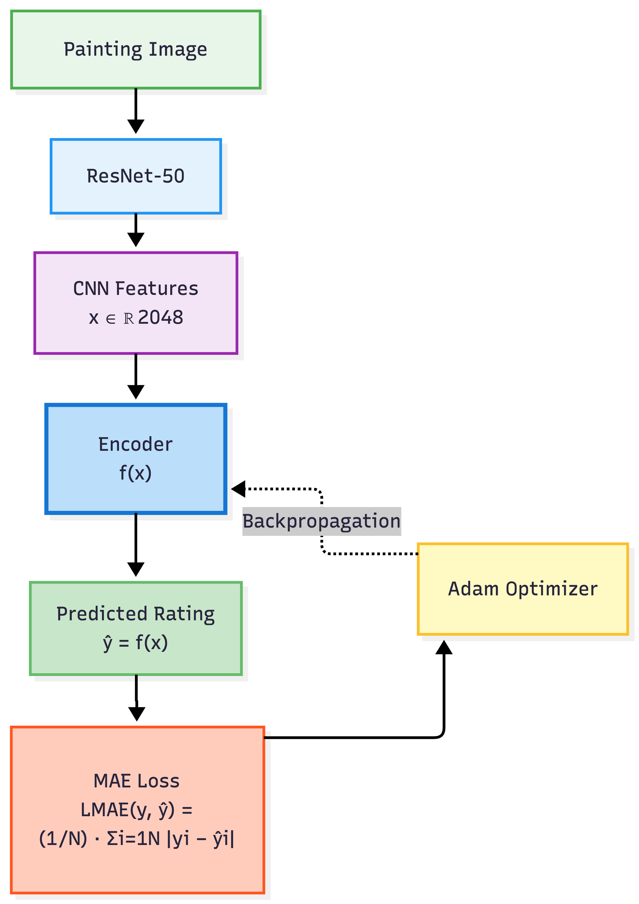
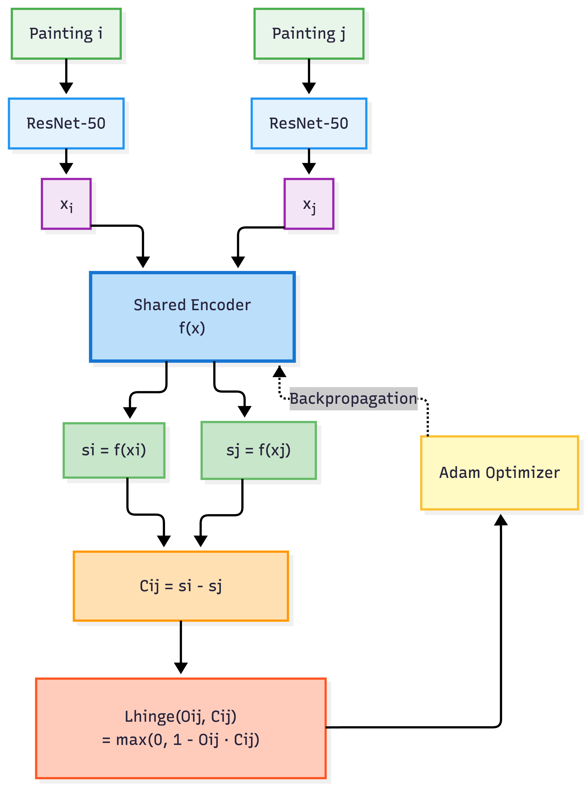
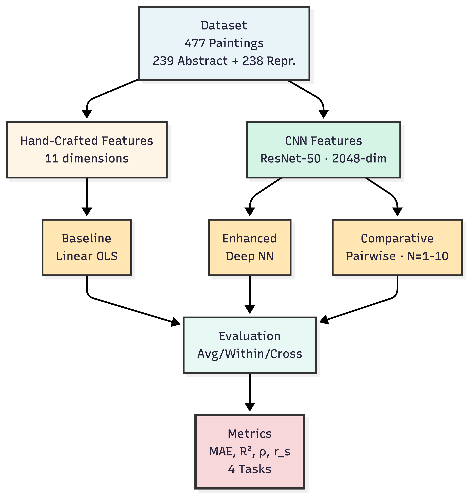

# Modeling Art Evaluations from Comparative Judgments

A deep learning approach to predicting aesthetic preferences in paintings, comparing regression-based and pairwise comparative learning models.

**Paper:** *Modeling Art Evaluations from Comparative Judgments: A Deep Learning Approach to Predicting Aesthetic Preferences* — IEEE Access

**Authors:** Manoj Reddy Bethi, Sai Rupa Jhade, Pravallika Yaganti, Monoshiz Mahbub Khan, Zhe Yu

Department of Software Engineering, Rochester Institute of Technology

## Overview

This repository provides a complete replication package for the paper. We compare three approaches to predicting aesthetic ratings of paintings:

1. **Baseline OLS Regression** — 11 handcrafted features (hue, symmetry, entropy, etc.)
2. **Deep Neural Network Regression** — ResNet-50 features with MLP encoder, trained on direct ratings
3. **Comparative Pairwise Learning** — Siamese architecture with hinge loss, trained on relative preferences only

Experiments are conducted across four conditions (Abstract/Representational x Beauty/Liking) using average, within-rater, and cross-rater evaluation settings. A human survey (n=5) validates that comparative judgments require 60% less annotation time than direct ratings.

## Architecture

### Deep Neural Network Regression
<p align="center">
  
</p>

Painting images are processed through ResNet-50 to extract 2048-dimensional features, fed into an MLP encoder with BatchNorm and Dropout, and output predicted ratings evaluated with MAE loss.

### Comparative Learning Framework
<p align="center">
  
</p>

Two paintings are processed in parallel through ResNet-50 and a shared encoder to produce utility scores. The difference between scores is evaluated against pairwise preference labels using hinge loss.

### Overall Methodology
<p align="center">
  
</p>

## Repository Structure

```
comparative_painting/
├── Data/                          # Input data (see Data/README.md for sources)
│   ├── RIT-Human-Aesthetic-*.csv  # Our original human survey data
│   ├── Abstract_Images/           # 240 abstract paintings (Sidhu et al., 2018)
│   ├── Representational_Images/   # 240 representational paintings
│   └── *.csv                      # Ratings and objective features
├── code/
│   ├── baseline/                  # OLS baseline regression
│   ├── deep_learning/             # Deep NN + Comparative models
│   └── human_survey/              # Human survey analysis (RQ4)
├── results/
│   ├── baseline/                  # OLS results
│   ├── deep_learning/             # Deep NN + Comparative results & plots
│   └── human_survey/              # Survey data, agreement, time comparison
└── figures/                       # Architecture diagrams
```

## Data

This project uses two data sources:

- **Original data (ours):** Human subjective experiment conducted via Qualtrics (6 respondents, 1 excluded, n=5). Located at `Data/RIT-Human-Aesthetic-Judgment-Study_November-27-2025_14.58.csv`.

- **External data ([Sidhu et al., 2018](https://doi.org/10.1371/journal.pone.0200431)):** 240 abstract and 240 representational paintings with beauty and liking ratings from multiple raters, plus 11 objective image features. Downloaded from [OSF](https://osf.io/2sy4f/).

See `Data/README.md` for full details.

## Reproducing Results

All scripts should be run from their respective directories.

### Prerequisites

```bash
pip install numpy pandas tensorflow scipy statsmodels matplotlib
```

### 1. Feature Extraction (optional, pre-computed features included)

```bash
cd code/deep_learning
python data_origin.py    # Extract ResNet-50 features (original image dimensions)
python data.py           # Extract ResNet-50 features (224x224 resized)
```

### 2. Baseline OLS Regression (Tables 1-5, baseline rows)

```bash
cd code/baseline
python baseline_model.py           # Table 1: average rating prediction
python baseline_within_cross.py    # Tables 2-5: within/cross-rater prediction
```

Results saved to `results/baseline/`.

### 3. Deep Neural Network Regression (Tables 1-5, Deep NN rows)

```bash
cd code/deep_learning
python experiment_runner.py        # Runs 10 runs x 10 raters, all conditions
```

Results saved to `results/deep_learning/regression/`.

### 4. Comparative Pairwise Learning (Tables 2-5, Comparative rows)

```bash
cd code/deep_learning
python comparitive_experiments.py  # Runs 10 runs x 5 raters x N=1-10
```

Results saved to `results/deep_learning/comparative/`.

### 5. Comparison Plots (Figure 4)

```bash
cd code/deep_learning
python plots.py                    # Generates regression vs comparative plots
```

Results saved to `results/deep_learning/plots/`.

### 6. Human Survey Analysis (Tables 6-10)

```bash
cd code/human_survey
python transform_survey_data.py              # Raw Qualtrics -> formatted CSVs
python survey_time_analysis.py               # Table 6: annotation time comparison
python human_rating_agreement_unified.py     # Tables 7-10: inter-rater agreement
```

Results saved to `results/human_survey/`.

## Results Summary

### RQ1: Deep NN vs Baseline (Table 1, Average Ratings)

| Condition | Model | R2 | Pearson | Spearman |
|-----------|-------|----|---------|----------|
| Abstract Beauty | Baseline | 0.090 | 0.299 | 0.276 |
| Abstract Beauty | Deep NN | 0.301 | 0.551 | 0.520 |
| Repr. Beauty | Baseline | 0.240 | 0.490 | 0.505 |
| Repr. Beauty | Deep NN | 0.445 | 0.670 | 0.654 |

The deep regression model achieves up to 328% improvement in R2 over the baseline.

### RQ4: Annotation Efficiency (Table 6)

| Condition | Direct Rating | Comparative | Reduction |
|-----------|--------------|-------------|-----------|
| Abstract | 25.32s | 13.89s | 45% |
| Representational | 29.23s | 7.53s | 74% |
| **Overall** | **27.28s** | **10.71s** | **60%** |

## Key Parameters

| Parameter | Value |
|-----------|-------|
| Train/test split | 140/remaining (~60/40) |
| Independent runs | 10 (averaged) |
| Epochs (regression) | 200 |
| Epochs (comparative) | 100 |
| Batch size | 10 |
| MLP architecture | 512 -> 256 -> 128 -> 1 |
| Feature dimension | 2048 (ResNet-50, avg pooling) |
| Comparative N | 1 to 10 pairs per painting |
| Regression loss | MAE |
| Comparative loss | Hinge |

## Citation

The painting dataset and baseline model used in this study is from:

```bibtex
@article{sidhu2018prediction,
  title={Prediction of beauty and liking ratings for abstract and representational paintings using subjective and objective measures},
  author={Sidhu, David M and McDougall, Katrina H and Jalava, Shaela T and Bodner, Glen E},
  journal={PLOS ONE},
  volume={13},
  number={7},
  pages={1--15},
  year={2018},
  doi={10.1371/journal.pone.0200431}
}
```

## License

This project is part of the [HiL-SE Lab](https://github.com/hil-se) at Rochester Institute of Technology.
