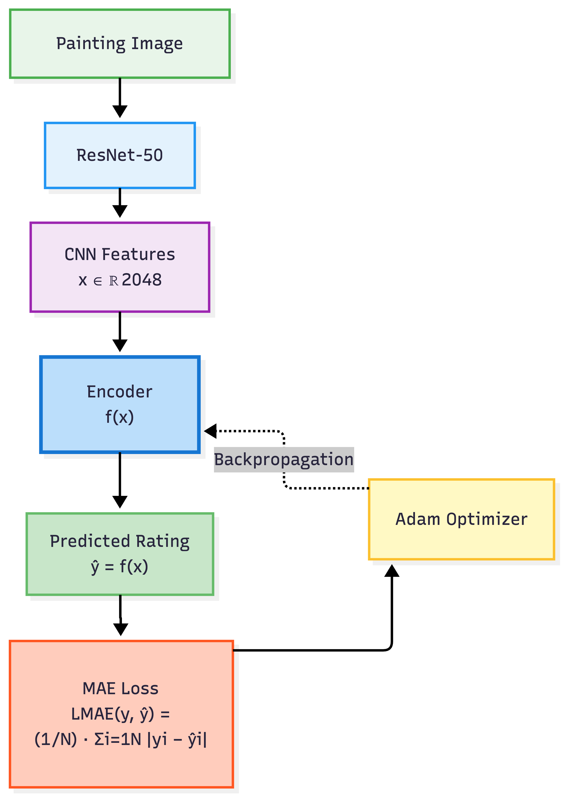
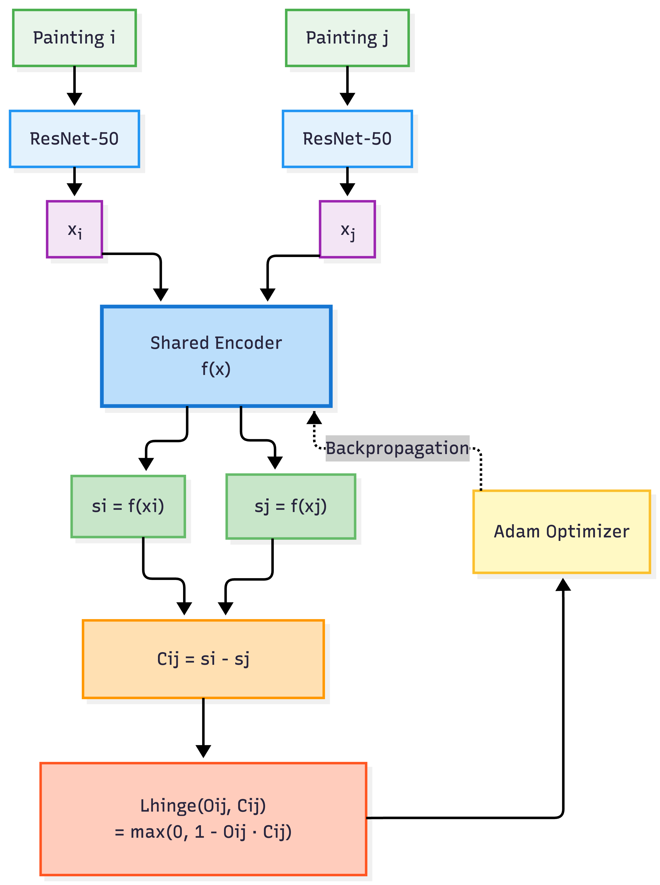
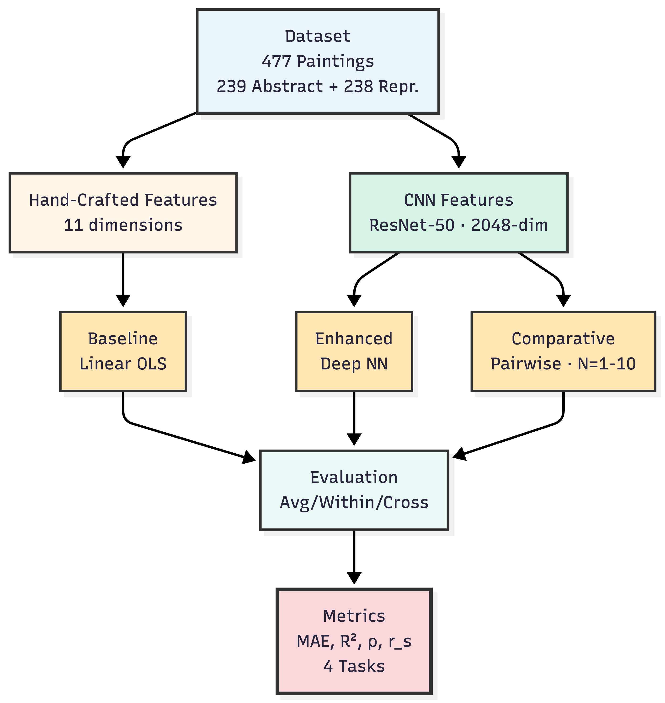

# Comparative Learning for Art Aesthetics

A deep learning approach to predicting aesthetic preferences in paintings,
comparing direct-rating regression with pairwise comparative learning.

**Paper:** *Comparative Learning for Art Aesthetics: Representation, Scale, and Annotation Efficiency* — IEEE Access revision, October 2026

**Authors:** Manoj Reddy Bethi, Xiaoyin Xi, Sai Rupa Jhade, Pravallika Yaganti, Monoshiz Mahbub Khan, Zhe Yu

Department of Software Engineering, Rochester Institute of Technology

## Overview

This repository provides a replication package for the paper. We compare
three approaches to predicting aesthetic ratings of paintings:

1. **Baseline OLS Regression** — 11 handcrafted image features, fitted on the training partition with training-only median imputation
2. **Deep Neural Network Regression** — fixed ResNet-50 or CLIP ViT-B/32 features with a shared MLP architecture, trained on direct ratings
3. **Comparative Pairwise Learning** — the same scoring architecture with hinge or Bradley–Terry loss, trained on relative preferences

Experiments cover four Sidhu conditions (Abstract/Representational ×
Beauty/Liking), 11 APDDv2 targets, and average, within-rater, and cross-rater
settings. Rater-level analyses use Sidhu because APDDv2 supplies aggregate
scores. A human survey with five retained responses compares annotation time
and agreement.

The final neural archive contains 78 result CSVs and 14,700 model fits. The
analysis verifies their hashes and complete experimental matrix, reproduces
RQ1–RQ4 tables and budget figures, and computes all 61 statistical contrasts.
See the [replication guide](code/deep_learning/README.md) for the source map,
provenance, external inputs, and complete training instructions.

## Architecture

The controlled experiments use a `256 -> 64 -> 1` scoring head with GELU,
LayerNorm, dropout 0.1, and L2 weight decay `1e-5`. It was selected using
APDDv2 validation data and locked for every dataset, target, objective,
rater, and seed. Regression uses MSE on training-standardized targets;
pairwise models use hinge or Bradley–Terry logistic loss.

The diagrams below document the original ResNet-50 implementation retained
in this repository. The controlled configuration is given in
[Key Parameters](#key-parameters) and the
[experiment protocol](code/deep_learning/art_extension_experiments.md).

### Deep Neural Network Regression

<p align="center">
  
</p>

### Comparative Learning Framework

<p align="center">
  
</p>

### Overall Methodology

<p align="center">
  
</p>

## Repository Structure

```text
comparative_painting/
├── Data/                            # Input data and source provenance
│   ├── Abstract_Images/             # 239 available Sidhu paintings
│   ├── Representational_Images/     # 238 available Sidhu paintings
│   ├── fixed_features/              # Recovered Sidhu CLIP bundle
│   └── provenance/                  # Original APDDv2 feature hashes
├── code/
│   ├── baseline/                    # Original OLS scripts and held-out refit
│   ├── deep_learning/               # Original and controlled neural models
│   │   └── jobs/tigris/             # Cluster launch scripts
│   └── human_survey/                # Human survey analysis (RQ4)
├── results/
│   ├── baseline/heldout_ols/        # Held-out OLS and sensitivity results
│   ├── deep_learning/
│   │   ├── extensions/              # Archived controlled fits and selection
│   │   └── paper/                   # Regenerated RQ1–RQ4 tables and plots
│   └── human_survey/                # Released survey data and original summaries
├── figures/                         # Original architecture diagrams
└── tests/                           # Data, model, and replication checks
```

The original scripts and result directories are retained. The October
revision uses `run_art_locked_head.py`, `run_sidhu_rater_locked_head.py`, and
the held-out OLS runner described below. Their outputs are recorded separately
from the earlier experiments.

## Data

This project uses three data sources:

- **Original data (ours):** A Qualtrics human study. Seven finished entries include one preview; six non-preview completions become five retained responses after excluding one constant-response rater.
- **External data ([Sidhu et al., 2018](https://doi.org/10.1371/journal.pone.0200431)):** Ratings and 11 objective features for 240 abstract and 240 representational paintings, obtained from [OSF](https://osf.io/2sy4f/). The controlled manifest joins the 477 available images by original painting ID.
- **External data ([APDDv2](https://github.com/BestiVictory/APDDv2)):** 10,022 matched images and 11 aggregate aesthetic targets. Obtain its annotations and images from the official source and prepare features using the replication guide.

See [Data/README.md](Data/README.md) for file descriptions and provenance.

## Reproducing Results

Run the following commands from the repository root with Python 3.12.

### Prerequisites

```bash
python -m venv .venv
source .venv/bin/activate
pip install -r requirements-analysis.txt
```

### 1. Held-Out OLS Baseline

```bash
python code/baseline/run_sidhu_heldout_ols.py
```

Results are saved to `results/baseline/heldout_ols/`. The runner restores
painting IDs, audits 474 predictor/image joins, and fits feature medians
using only the assigned training paintings. Complete-case sensitivity uses
the same partitions.

### 2. Paper Tables, Statistical Tests, and Figures

```bash
python code/deep_learning/reproduce_art_paper.py
python -m unittest discover -s tests -v
```

Results are saved to `results/deep_learning/paper/`, including the RQ4
agreement matrices and timing summaries. Regeneration runs on a CPU without
cluster access or an APDDv2 image download. TensorFlow-specific tests run
when the training dependencies are installed.

### 3. Feature Preparation (Optional)

Install the training dependencies to prepare inputs for new neural runs:

```bash
pip install -r requirements-training.txt
python code/deep_learning/build_art_manifests.py \
  --dataset sidhu \
  --output build/manifests/sidhu.csv \
  --resnet-output build/features/sidhu-resnet50.npz
```

The recovered CLIP features are in
`Data/fixed_features/sidhu-clip-vit-b32.npz`. APDDv2 preparation and fresh
feature extraction are documented in the
[replication guide](code/deep_learning/README.md).

### 4. Controlled Regression and Comparative Learning

```bash
python code/deep_learning/run_art_locked_head.py \
  --manifest build/manifests/sidhu.csv \
  --features Data/fixed_features/sidhu-clip-vit-b32.npz \
  --dataset sidhu --representation clip-vit-b32 \
  --category abstract --target beauty \
  --objectives regression,hinge,bradley_terry \
  --n-values 1-10 --seeds 0-9 \
  --epochs-regression 200 --epochs-pairwise 200 --patience 20 \
  --output build/reruns/sidhu-abstract-beauty-clip.csv
```

Repeat for both categories, both targets, and both representations.
Rater-level examples and cluster launch scripts are in `code/deep_learning/`.

### 5. Human Survey Analysis

`code/human_survey/` retains the survey transformation, timing, and agreement
scripts. The paper analysis in step 2 regenerates the October revision's
summaries from the released survey responses. Human-to-human agreement
averages ten unique retained-rater pairs and excludes ground truth; agreement
with ground truth is reported separately.

## Results Summary

### RQ1: Representation Comparison

| Dataset | ResNet-50 Spearman | CLIP Spearman |
|---------|-------------------|---------------|
| Sidhu, mean over four conditions | 0.534 | 0.732 |
| APDDv2, mean over 11 targets | 0.701 | 0.775 |

Held-out OLS Spearman is 0.339/0.382/0.408/0.485 for Abstract Beauty/Liking
and Representational Beauty/Liking. All nine RQ1 contrasts have Holm-adjusted
`p=0.017578125`.

### RQ2: Comparative Learning at N=10

| Dataset | Regression | Hinge | Bradley–Terry |
|---------|------------|-------|---------------|
| Sidhu | 0.732 | 0.767 | 0.772 |
| APDDv2 | 0.775 | 0.764 | 0.764 |

Pairwise gains over regression are significant on Sidhu after Holm
correction. On APDDv2, pairwise objectives are approximately 0.011 below
regression. Hinge and Bradley–Terry are not significantly different at this
budget on either dataset.

### RQ3: Within-Rater and Cross-Rater Prediction

At `N=1`, rater-level Spearman ranges from 0.208 to 0.413 within rater and
from 0.011 to 0.391 across raters. Within-rater prediction is stronger, and
cross-rater Abstract Liking is near zero.

### RQ4: Annotation Efficiency and Agreement

| Condition | Direct Rating | Comparative | Reduction |
|-----------|---------------|-------------|-----------|
| Abstract | 25.32s | 13.89s | 45% |
| Representational | 29.23s | 7.53s | 74% |
| **Overall** | **27.28s** | **10.71s** | **60%** |

The displayed overall times average the rounded condition means, following
the paper; full precision values are also exported. Human-to-human agreement
is 0.725 for direct ratings and 0.520 for comparisons in the five-rater
panel. These findings describe the retained sample.

See the [complete result summary](results/deep_learning/art_extension_results.md).

## Key Parameters

| Parameter | Value |
|-----------|-------|
| Sidhu train/validation/test split | 140/20/remainder, per seed |
| APDDv2 train/validation/test split | 70/15/15, per seed |
| Independent runs | 10 matched seeds (0–9) |
| Maximum epochs | 200 per objective |
| Batch size | 128 |
| MLP architecture | 256 -> 64 -> 1; GELU and LayerNorm |
| Feature dimension | 2048 (ResNet-50), 512 (CLIP ViT-B/32) |
| Comparative N | 1–10; N = training pairs / training items |
| Regression loss | MSE on training-standardized targets |
| Comparative loss | Hinge or Bradley–Terry |
| Optimization | Adam, learning rate 1e-3 |
| Early stopping | Validation Spearman; minimum 25 epochs, patience 20 |
| Head selection | 22 configurations screened, top three confirmed on APDDv2 validation |

Selection records are in `results/deep_learning/extensions/head_selection/`.
The selected head's validation macro Spearman is 0.77719858. Its configuration
is locked across every final experiment.

## Citation


The painting dataset and baseline model used in this study is from:

```bibtex
@article{sidhu2018prediction,
  title={Prediction of beauty and liking ratings for abstract and representational paintings using subjective and objective measures},
  author={Sidhu, David M and McDougall, Katrina H and Jalava, Shaela T and Bodner, Glen E},
  journal={PLOS ONE},
  volume={13},
  number={7},
  pages={1--15},
  year={2018},
  doi={10.1371/journal.pone.0200431}
}
```

## License

This project is part of the [HiL-SE Lab](https://github.com/hil-se) at Rochester Institute of Technology.
