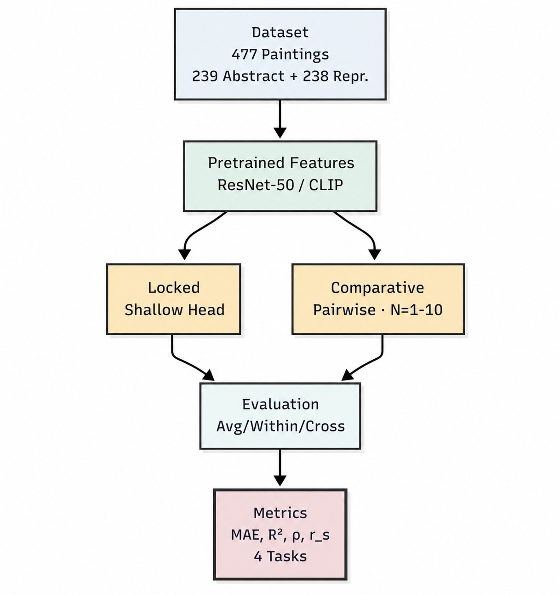
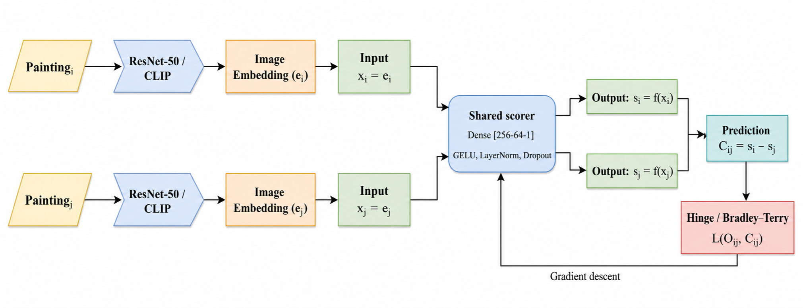

# Comparative Learning for Art Aesthetics

**Paper:** *Comparative Learning for Art Aesthetics: Representation, Scale, and Annotation Efficiency* — IEEE Access

**Authors:** Manoj Reddy Bethi, Xiaoyin Xi, Sai Rupa Jhade, Pravallika Yaganti, Monoshiz Mahbub Khan, Zhe Yu

Department of Software Engineering, Rochester Institute of Technology

## Overview

This repository reproduces the experiments reported in the paper:

1. **OLS Baseline** — the original 11-feature model refitted on matched training partitions, with training-only median imputation and complete-case sensitivity
2. **Neural Regression** — fixed ResNet-50 and CLIP ViT-B/32 features with a shared prediction head
3. **Comparative Learning** — the same head trained with hinge or Bradley–Terry loss at pair budgets N=1–10
4. **Human Study** — annotation time and pairwise agreement for direct and comparative judgments

The released computational results contain 14,700 fits across ten seeds.
See the [replication guide](code/deep_learning/README.md) for the paper's
table-to-data mapping, head selection, and training commands.

## Architecture

### Evaluation Workflow

<p align="center">
  
</p>

### Comparative Learning Framework

<p align="center">
  
</p>

Fixed image features feed a `256 -> 64 -> 1` head with GELU, LayerNorm,
dropout 0.1, and L2 regularization 1e-5. The head is selected using APDDv2
validation Spearman and then fixed across all reported experiments.

## Repository Structure

```text
comparative_painting/
├── Data/                         # Painting images, ratings, predictors, survey
│   └── fixed_features/           # Sidhu CLIP feature bundle
├── code/
│   ├── baseline/                 # Matched held-out OLS refit
│   ├── deep_learning/            # Feature extraction, models, statistics, plots
│   │   └── feature/              # Released Sidhu ResNet arrays
│   └── human_survey/             # Survey transformation, timing, agreement
├── results/
│   ├── baseline/heldout_ols/     # OLS results and sensitivity analysis
│   ├── deep_learning/
│   │   ├── aggregate/            # Sidhu and APDDv2 aggregate experiments
│   │   ├── rater/                # Sidhu within- and cross-rater experiments
│   │   ├── head_selection/       # Validation screening and confirmation
│   │   └── paper/                # RQ1–RQ3 tables and statistical analyses
│   └── human_survey/             # Survey responses and RQ4 paper results
└── figures/                      # The paper's workflow and budget figures
```

## Data

- **Sidhu et al. (2018):** 239 available abstract and 238 representational paintings, beauty and liking ratings, and 11 objective predictors. The original source is [OSF](https://osf.io/2sy4f/).
- **APDDv2:** 10,022 matched images and 11 aggregate targets. Obtain annotations and images from the [official dataset repository](https://github.com/BestiVictory/APDDv2).
- **Human survey:** the released Qualtrics responses and question-level ratings/comparisons. The reported analyses use five retained participants.

See [Data/README.md](Data/README.md) for the source files.

## Reproducing Results

Run commands from the repository root with Python 3.12.

### Prerequisites

```bash
python -m venv .venv
source .venv/bin/activate
pip install -r requirements-analysis.txt
```

### 1. Held-Out OLS Baseline

```bash
python code/baseline/run_sidhu_heldout_ols.py
```

Outputs are written to `results/baseline/heldout_ols/`. Feature medians use
only the assigned training paintings. The complete-case analysis keeps the
same partitions. `feature_alignment.csv` records the image brightness and
saturation comparison described in the paper.

### 2. Paper Tables and Figures

```bash
python code/deep_learning/reproduce_art_paper.py
```

This regenerates RQ1–RQ3 tables and statistical analyses in
`results/deep_learning/paper/`, RQ4 results in `results/human_survey/paper/`,
and the two budget plots in `figures/`. It runs on a CPU using the released
experiment CSVs.

### 3. Feature Preparation and Model Training

```bash
pip install -r requirements-training.txt
python code/deep_learning/build_art_manifests.py \
  --dataset sidhu --output build/manifests/sidhu.csv \
  --resnet-output build/features/sidhu-resnet50.npz
python code/deep_learning/run_art_locked_head.py \
  --manifest build/manifests/sidhu.csv \
  --features Data/fixed_features/sidhu-clip-vit-b32.npz \
  --dataset sidhu --representation clip-vit-b32 \
  --category abstract --target beauty \
  --objectives regression,hinge,bradley_terry \
  --n-values 1-10 --seeds 0-9 \
  --output build/reruns/sidhu-abstract-beauty-clip.csv
```

Repeat for both painting categories, both rating targets, and both
representations. The [replication guide](code/deep_learning/README.md) gives
APDDv2, rater-level, and head-selection commands.

## Results Summary

### RQ1: Visual Representation

| Dataset | ResNet-50 Spearman | CLIP Spearman |
|---------|-------------------|---------------|
| Sidhu, four-condition mean | 0.534 | 0.732 |
| APDDv2, 11-target mean | 0.701 | 0.775 |

Matched held-out OLS Spearman is 0.339/0.382/0.408/0.485 for Abstract
Beauty/Liking and Representational Beauty/Liking.

### RQ2: Comparative Learning at N=10

| Dataset | Regression | Hinge | Bradley–Terry |
|---------|------------|-------|---------------|
| Sidhu | 0.732 | 0.767 | 0.772 |
| APDDv2 | 0.775 | 0.764 | 0.764 |

### RQ3: Within-Rater and Cross-Rater Prediction

At N=1, within-rater Spearman ranges from 0.208 to 0.413 and cross-rater
Spearman from 0.011 to 0.391. Within-rater prediction is stronger across the
reported conditions.

### RQ4: Annotation Efficiency

| Condition | Direct Rating | Comparative | Reduction |
|-----------|---------------|-------------|-----------|
| Abstract | 25.32s | 13.89s | 45% |
| Representational | 29.23s | 7.53s | 74% |
| **Overall** | **27.28s** | **10.71s** | **60%** |

Human-to-human agreement averages 0.725 for direct ratings and 0.520 for
comparative judgments. Overall displayed times follow the paper's averaging
of rounded condition means; full precision values are also exported.

## Key Parameters

| Parameter | Value |
|-----------|-------|
| Sidhu train/validation/test split | 140/20/remainder |
| APDDv2 train/validation/test split | 70/15/15 |
| Runs | Ten matched seeds (0–9) |
| Maximum epochs | 200 |
| Batch size | 128 |
| Head | 256 -> 64 -> 1, GELU, LayerNorm |
| Regression loss | MSE on training-standardized targets |
| Pairwise loss | Hinge or Bradley–Terry |
| Pair budget | N=1–10; N = training pairs / training items |
| Optimizer | Adam, learning rate 1e-3 |
| Early stopping | Validation Spearman, minimum 25 epochs, patience 20 |

The released sampler shuffles training anchors and eligible partners,
rejecting ties and repeated unordered pairs. This is the implementation used
for the reported results; the manuscript describes global uniform sampling.

## Citation

The painting dataset and baseline model used in this study is from:

```bibtex
@article{sidhu2018prediction,
  title={Prediction of beauty and liking ratings for abstract and representational paintings using subjective and objective measures},
  author={Sidhu, David M and McDougall, Katrina H and Jalava, Shaela T and Bodner, Glen E},
  journal={PLOS ONE},
  volume={13},
  number={7},
  pages={1--15},
  year={2018},
  doi={10.1371/journal.pone.0200431}
}
```

## License

This project is part of the [HiL-SE Lab](https://github.com/hil-se) at Rochester Institute of Technology.
